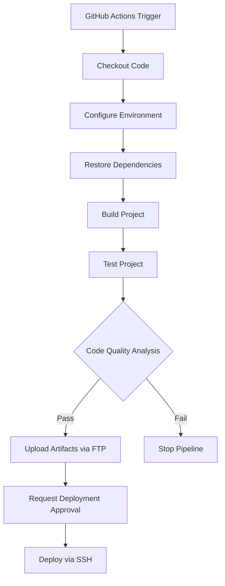

# PoC GitHub Actions CI Pipeline for .NET Framework

[](https://wakatime.com/badge/github/GuilhermeStracini/POC-GHActions-CI-NetFramework)
[](https://github.com/GuilhermeStracini/POC-GHActions-CI-NetFramework)
[](https://github.com/GuilhermeStracini/POC-GHActions-CI-NetFramework)

[](https://github.com/GuilhermeStracini/POC-GHActions-CI-NetFramework/actions/workflows/build-bump-version.yml)
[](https://github.com/GuilhermeStracini/POC-GHActions-CI-NetFramework/actions/workflows/build-deploy.yml)
[](https://github.com/GuilhermeStracini/POC-GHActions-CI-NetFramework/actions/workflows/linter.yml)
[](https://github.com/GuilhermeStracini/POC-GHActions-CI-NetFramework/actions/workflows/update-packages.yml)

[](https://codeclimate.com/github/GuilhermeStracini/POC-GHActions-CI-NetFramework/maintainability)
[](https://codeclimate.com/github/GuilhermeStracini/POC-GHActions-CI-NetFramework/test_coverage)
[](https://www.codefactor.io/repository/github/GuilhermeStracini/POC-GHActions-CI-NetFramework)

---

## Overview

This repository demonstrates a **proof of concept (PoC)** for implementing a CI/CD pipeline for a **.NET Framework 4.8** project using **GitHub Actions**. 

🔗 For a detailed walkthrough, check out the accompanying blog article:  
[Using GitHub Actions to Create a .NET Framework Pipeline: Build, Test, and Deploy!](https://blog.guilhermebranco.com.br/using-github-actions-to-create-a-net-framework-pipeline-build-test-and-deploy/)

---

## Features

### Pipeline Highlights

- **Environment Setup**:
  - Configure tools (MSBuild, VSTest, NuGet, Java for SonarCloud).
  - Cache dependencies for faster execution.

- **Build and Test**:
  - Restore dependencies and build the project.
  - Run unit tests using VSTest.

- **Code Quality and Security**:
  - Generate metrics using SonarCloud, Codacy, Code Climate, Snyk, and more.

- **Deployment**:
  - Request approval for deployment.
  - Upload artifacts via FTP.
  - Execute deployment commands via SSH.

### Pipeline Workflow



---

## Getting Started

### Prerequisites

Ensure you have the following tools installed:

- **.NET Framework Developer Tools**  
- **Git**  
- CI/CD tools for your environment as outlined in the workflow scripts.

### Steps to Use

1. **Clone the Repository**:
   ```bash
   git clone https://github.com/GuilhermeStracini/POC-GHActions-CI-NetFramework.git
   ```

2. **Review and Customize**:
   - Review the GitHub Actions workflows in `.github/workflows/` to tailor them to your needs.

3. **Run Locally** (Optional):
   - Build and test the project locally:
     ```bash
     msbuild YourSolution.sln
     vstest.console.exe YourTests.dll
     ```

4. **Push Changes**:
   - Push changes to trigger the pipeline:
     ```bash
     git push origin main
     ```

---

## Contribution

Contributions are welcome!  
Feel free to fork this repository, open issues, or submit pull requests to enhance the pipeline or project functionality.

---

## License

This project is licensed under the [MIT License](LICENSE).
